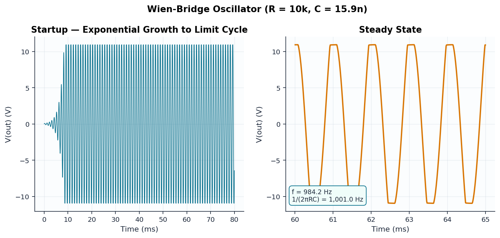
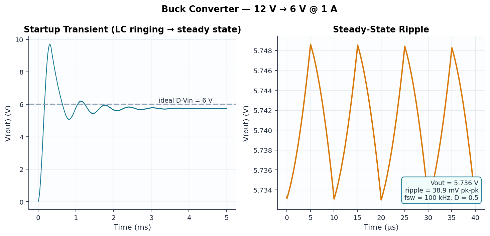

# ⚡ Analog Circuit Lab

**An automated analog circuit design & verification lab built on [ngspice](https://ngspice.sourceforge.io).**

[](https://github.com/ayondey47/analog-circuit-lab/actions/workflows/ci.yml)
[](https://ngspice.sourceforge.io)
[](https://www.python.org)
[](LICENSE)

Eight classic analog circuits — filters, amplifiers, an oscillator, a switching
converter, a rectifier, and a Monte Carlo tolerance study — each designed by hand
analysis, simulated in ngspice, and **verified by an automated test suite that
asserts the simulation matches circuit theory**. The CI badge above is green only
when every measured cutoff, gain, frequency, and ripple agrees with the math.

> 📊 Every number in [docs/RESULTS.md](docs/RESULTS.md) is regenerated from live
> simulations on every push — nothing here is hand-waved.

---

## The Circuits

| # | Circuit | Analysis | Key result (simulated vs. theory) |
|---|---------|----------|------------------------------------|
| 01 | [RC low-pass filter](circuits/01_rc_lowpass/) | AC sweep | f₋₃dB **1588 Hz** vs 1592 Hz (−0.24%) |
| 02 | [Sallen-Key Butterworth LPF](circuits/02_sallen_key/) | AC sweep | f₋₃dB **9.99 kHz** vs 10.00 kHz, −40 dB/dec |
| 03 | [BJT common-emitter amplifier](circuits/03_common_emitter/) | OP + AC + TRAN | gain **25.8 dB** vs 25.5 dB (rₑ model) |
| 04 | [MOSFET differential pair](circuits/04_diff_pair/) | OP + AC + DC sweep | A_dm **22.98 dB** vs 22.98 dB (gm·R_D∥r_o) |
| 05 | [Wien-bridge oscillator](circuits/05_wien_bridge/) | Transient | f_osc **984 Hz** vs 1001 Hz (1/2πRC) |
| 06 | [Buck converter 12 V → 6 V](circuits/06_buck_converter/) | Switching transient | V_out **5.74 V**, ripple 39 mV pk-pk |
| 07 | [Bridge rectifier + filter](circuits/07_bridge_rectifier/) | Transient | ripple **1.08 V** @ 120 Hz vs I/2fC estimate |
| 08 | [Monte Carlo tolerance study](circuits/08_monte_carlo/) | 300 × AC sweep | σ(f₋₃dB) **2.0%**, 98.7% yield within ±5% |

## Gallery

| | |
|---|---|
|  |  |
|  |  |
|  |  |
|  |  |

## Why This Exists

SPICE decks are easy to write and easy to get silently wrong. This lab treats
circuit simulation the way good software treats code:

1. **Design from first principles.** Every netlist header documents the hand
   analysis: bias points, gain equations, cutoff formulas, expected ripple.
2. **Simulate for real.** `lab/runner.py` drives ngspice in batch mode; results
   are exported with `wrdata` and parsed by `lab/wrdata.py`.
3. **Verify against theory.** `tests/test_circuits.py` measures each simulation
   with `lab/metrics.py` (log-interpolated −3 dB points, dB/decade slopes,
   zero-crossing frequency estimation, ripple extraction) and asserts agreement
   with the analytical model — e.g. the diff-pair gain must match
   gm·(R_D∥r_o) computed from the *simulated* operating point within 0.5 dB.
4. **Quantify manufacturing reality.** The Monte Carlo study re-renders the
   Sallen-Key netlist 300 times with truncated-gaussian component tolerances
   and measures the resulting cutoff distribution and yield.

## Repository Layout

```
analog-circuit-lab/
├── circuits/            # one folder per circuit: netlist + design notes
│   ├── 01_rc_lowpass/
│   ├── ...
│   └── 08_monte_carlo/  # parameterized netlist template
├── lab/                 # Python toolkit
│   ├── runner.py        # ngspice discovery + batch execution
│   ├── wrdata.py        # wrdata ASCII output parser
│   ├── metrics.py       # cutoff, slope, gain, ripple, frequency measurement
│   ├── montecarlo.py    # tolerance sampling + netlist templating
│   └── plots.py         # consistent plot styling/annotations
├── scripts/run_all.py   # run everything, regenerate plots + RESULTS.md
├── tests/               # 35 tests: unit tests + physics verification suite
└── docs/                # generated plots and results table
```

## Quick Start

```bash
# 1. Install ngspice
sudo apt-get install ngspice          # Debian/Ubuntu
brew install ngspice                  # macOS
# Windows: https://ngspice.sourceforge.io (or set NGSPICE_EXE to the binary)

# 2. Install Python dependencies
pip install -r requirements.txt

# 3. Verify physics (runs every simulation)
pytest -v

# 4. Regenerate all plots and the results table
python scripts/run_all.py
```

Run a single circuit interactively:

```bash
ngspice -b circuits/05_wien_bridge/wien_bridge.cir
```

## Measurement Toolkit

`lab/metrics.py` implements simulator-agnostic waveform measurements:

| Function | Method |
|----------|--------|
| `cutoff_frequency` | −3 dB crossing, log-frequency interpolation |
| `slope_db_per_decade` | gain delta between two interpolated points |
| `dominant_frequency` | rising zero crossings with sub-sample interpolation |
| `dc_average` | trapezoidal time-weighted mean over the steady-state window |
| `ripple_pp` / `amplitude` | peak-to-peak extraction after settling |

## License

MIT — see [LICENSE](LICENSE).
