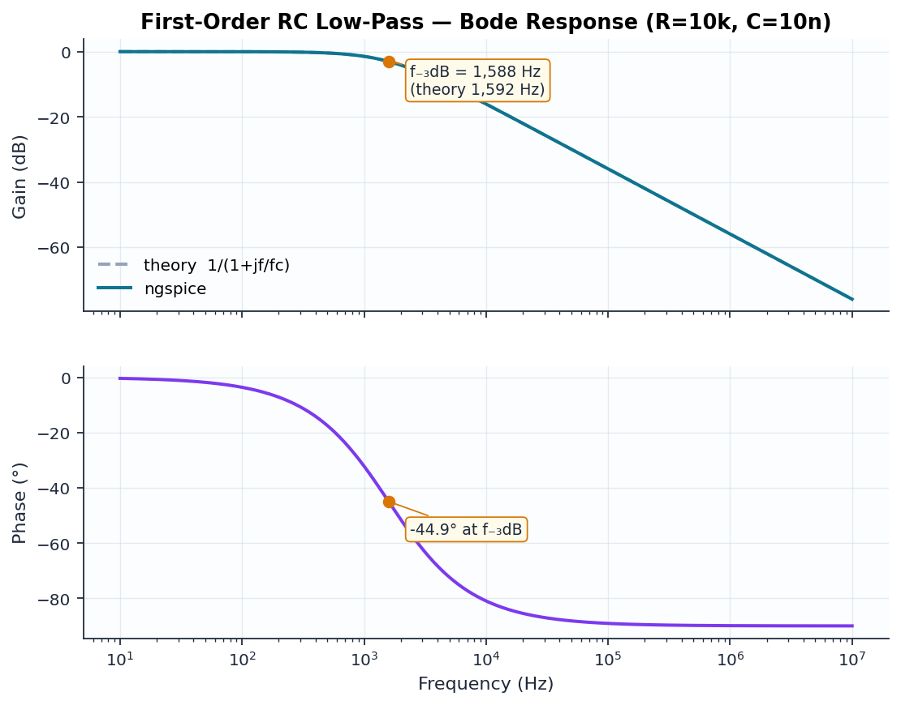

# 01 — First-Order RC Low-Pass Filter

```
  in ──[ R1 10k ]──┬── out
                   │
                 [ C1 ]
                  10n
                   │
                  GND
```

## Design

The canonical single-pole filter. Transfer function:

$$H(s) = \frac{1}{1 + sRC}$$

| Quantity | Formula | Value |
|----------|---------|-------|
| Cutoff | f₋₃dB = 1/(2πRC) | **1591.5 Hz** |
| Rolloff | first-order | **−20 dB/decade** |
| Phase at fc | arctan(1) | **−45°** |

## Verified results

| Quantity | Theory | ngspice | Error |
|----------|--------|---------|-------|
| f₋₃dB | 1591.5 Hz | 1587.8 Hz | −0.24% |
| Slope (100k→1M) | −20 dB/dec | −20.00 dB/dec | 0.00% |
| Phase at fc | −45° | −44.9° | — |


