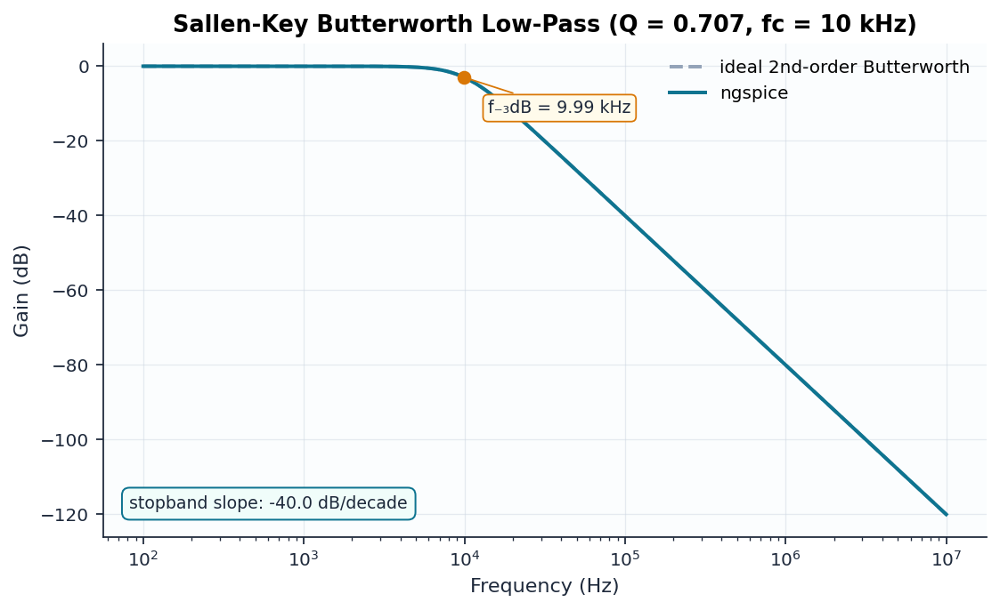

# 02 — Sallen-Key 2nd-Order Butterworth Low-Pass

```
                       ┌──────[ C1 2n ]──────┐
                       │                     │
  in ──[ R1 11.25k ]───┴──[ R2 11.25k ]──┬───┤
                                         │   │+\
                                      [ C2 ]  >──┬── out
                                        1n  ┌┤-/   │
                                         │  └──────┘  (unity-gain buffer)
                                        GND
```

## Design

Unity-gain Sallen-Key with equal resistors. With R1 = R2 = R:

$$f_c = \frac{1}{2\pi R\sqrt{C_1 C_2}}, \qquad Q = \frac{1}{2}\sqrt{\frac{C_1}{C_2}}$$

Choosing **C1/C2 = 2** gives Q = 1/√2 = 0.7071 — a maximally-flat
**Butterworth** response. R = 11.25 kΩ places fc at 10.004 kHz.

The op-amp is an ideal VCVS (gain 10⁶) wired as a unity-gain follower —
appropriate here because the verification target is the *filter topology*,
not op-amp non-idealities.

## Verified results

| Quantity | Theory | ngspice | Error |
|----------|--------|---------|-------|
| Passband gain | 0 dB | 0.00 dB | 0.00% |
| f₋₃dB | 10.004 kHz | 9.991 kHz | −0.12% |
| Stopband slope | −40 dB/dec | −40.0 dB/dec | 0.00% |


