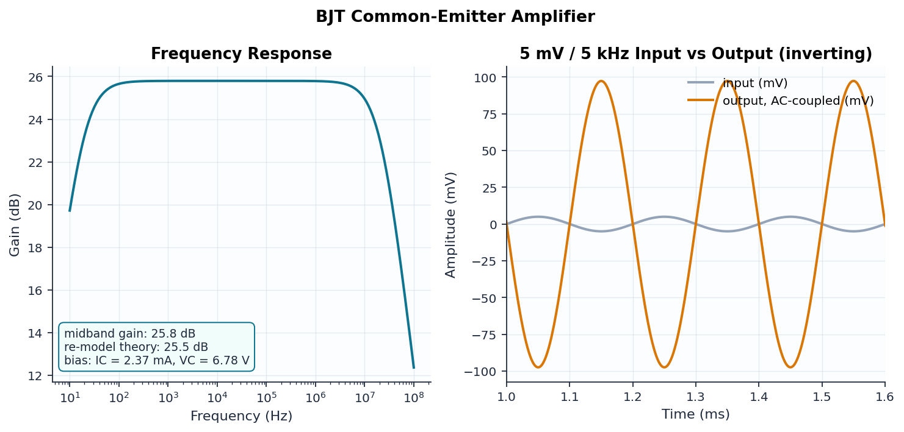

# 03 — BJT Common-Emitter Amplifier

```
            VCC +12V
          ┌────┬────┐
       [ R1 ] [ RC ]
        47k    2.2k
          │     ├──────── out (VC ≈ 6.8 V)
          ├──┐  │
 in ─[CIN]┤  └─B┤ Q1 (NPN, β=200)
          │    E┤
       [ R2 ]   ├─[ RE1 100 ]─┬─[ RE2 460 ]─ GND
        10k     │             └──[ CE 100µ ]─ GND
          │
         GND
```

## Design

Voltage-divider bias with a **partially bypassed emitter**: RE2 is bypassed by
CE for AC, leaving RE1 = 100 Ω as local series feedback. This makes the gain
depend on a resistor ratio instead of the (temperature-sensitive) intrinsic rₑ:

| Quantity | Formula | Value |
|----------|---------|-------|
| Base voltage | VCC·R2/(R1+R2) − I_B·R_TH | ≈ 2.0 V |
| Emitter current | (V_B − V_BE)/(RE1+RE2) | ≈ 2.4 mA |
| Collector voltage | VCC − I_C·RC | ≈ 6.8 V (near mid-rail) |
| Intrinsic rₑ | V_T/I_E | ≈ 10.8 Ω |
| Midband gain | −(RC ∥ r_o)/(rₑ + RE1) | ≈ −18.9 (25.5 dB) |

The test suite recomputes the theory **from the simulated operating point**
(rₑ from measured I_C, r_o = V_AF/I_C) and requires agreement within 1 dB.

## Verified results

| Quantity | Theory | ngspice | Error |
|----------|--------|---------|-------|
| V_C | ≈ 6.8 V | 6.78 V | ✓ near mid-rail |
| I_C | 2.4 mA | 2.37 mA | −1.2% |
| Midband gain | 25.5 dB | 25.8 dB | +1.1% |


