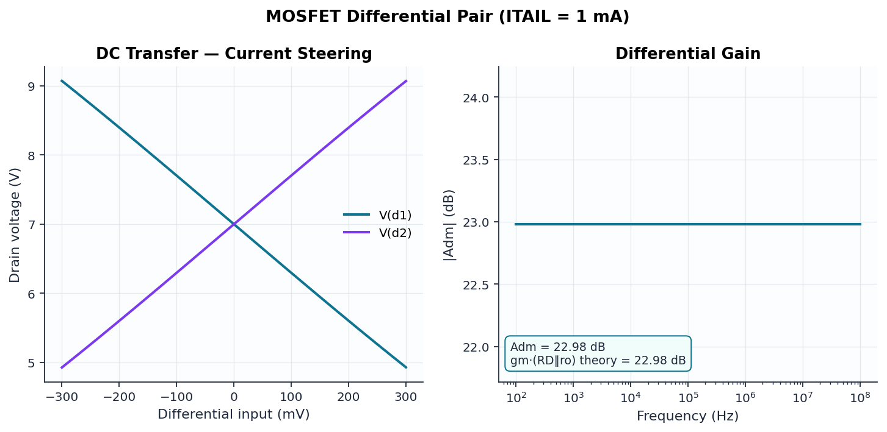

# 04 — MOSFET Differential Pair

```
        VDD +12V
       ┌───┬───┐
    [ RD1 ] [ RD2 ]
      10k     10k
       ├ d1    ├ d2
  g1 ─┤M1      M2├─ g2
       └───┬───┘
           │ s
       ( ITAIL 1mA )
           │
        VSS −12V
```

## Design

The workhorse input stage of every op-amp. Ideal tail source splits 1 mA
equally; level-1 NMOS devices (KP = 200 µA/V², W/L = 10, λ = 0.01):

| Quantity | Formula | Value |
|----------|---------|-------|
| Drain current | I_TAIL/2 | 0.5 mA |
| Overdrive | √(2·I_D/(KP·W/L)) | 0.224 V |
| Transconductance | √(2·KP·(W/L)·I_D·(1+λV_DS)) | 1.474 mS |
| Output resistance | (1+λV_DS)/(λ·I_D) | 217 kΩ |
| Differential gain | g_m·(R_D ∥ r_o) | 14.1 (22.98 dB) |

The DC sweep demonstrates **current steering**: ±√2·V_OV ≈ ±0.32 V of
differential input fully commutates the tail current between the two drains.

## Verified results

| Quantity | Theory | ngspice | Error |
|----------|--------|---------|-------|
| V_D1 = V_D2 (symmetry) | 7.00 V | 7.00 V | < 1 mV mismatch |
| I_D per side | 0.5 mA | 0.5 mA | < 1% |
| A_dm | 22.98 dB | 22.98 dB | 0.00% |


