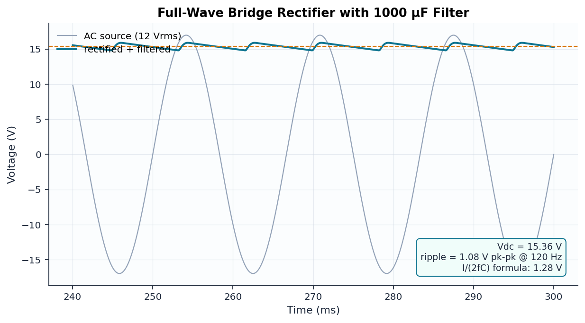

# 07 — Full-Wave Bridge Rectifier with Capacitor Filter

```
            ┌──[ D1 ]──┬── pos
   ac1 ─────┤          │
            ├──[ D3 ]──┼── GND     [ C1 1000µ ]  [ RL 100Ω ]
   ac2 ─────┤          │            pos ── GND    pos ── GND
            ├──[ D2 ]──┴── pos
            └──[ D4 ]───── GND
   (12 Vrms, 60 Hz source between ac1 and ac2)
```

## Design

| Quantity | Formula | Value |
|----------|---------|-------|
| Peak input | √2 · 12 Vrms | 16.97 V |
| DC output | V_pk − 2·V_D − ripple/2 | ≈ 14.7 V |
| Ripple (estimate) | I_dc/(2·f·C) | ≈ 1.2–1.3 V pk-pk |
| Ripple frequency | 2·f_line | 120 Hz |

The classic I/(2fC) formula assumes the capacitor discharges for a full half
cycle; in reality the diodes re-conduct before that, so it **overestimates**
ripple by 10–20%. The test suite encodes that as an asymmetric tolerance —
an example of knowing what your formulas are actually worth.

## Verified results

| Quantity | Theory | ngspice | Notes |
|----------|--------|---------|-------|
| V_dc | ≈ 14.7 V | 15.36 V | within diode-model spread |
| Ripple | 1.28 V (estimate) | 1.08 V pk-pk | formula is an upper bound |
| Ripple frequency | 120 Hz | 120 Hz | full-wave confirmed |


