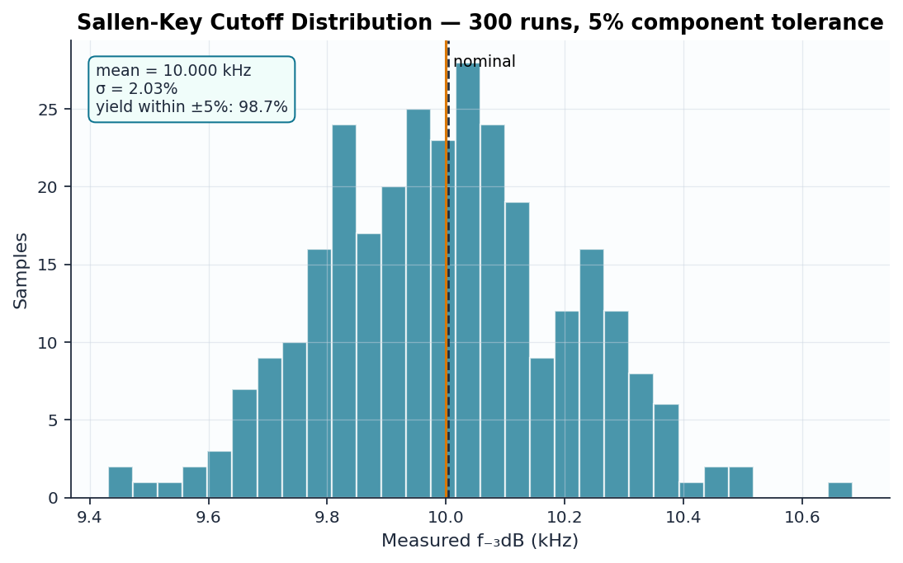

# 08 — Monte Carlo Tolerance Analysis

What happens to the Sallen-Key filter from [circuit 02](../02_sallen_key/)
when it's built with real ±5% components?

## Method

`lab/montecarlo.py` re-renders `sallen_key_mc.template.cir` 300 times with
R1, R2, C1, C2 each drawn from a **truncated gaussian** (σ = tolerance/3,
clipped at ±tolerance — the standard model for binned commercial parts),
runs each sample through ngspice, and measures the −3 dB cutoff of every one.

## Expected statistics

Since f_c ∝ (R1·R2·C1·C2)^(−1/2), small relative deviations add in quadrature
with weight ½ each:

$$\frac{\sigma_{f_c}}{f_c} \approx \sqrt{4 \cdot \left(\tfrac{1}{2}\sigma_{comp}\right)^2} = \sigma_{comp} \approx 1.7\%$$

## Verified results (300 runs, seed = 42)

| Quantity | Theory | Measured |
|----------|--------|----------|
| Mean cutoff | 10.004 kHz | 10.000 kHz (−0.04%) |
| σ(f_c) | ≈ 1.7% | 2.0% |
| Yield within ±5% of nominal | — | **98.7%** |

